# dftracer-agents Pipeline

End-to-end flow from source clone to I/O optimization, showing every MCP tool call in order and which service sub-server owns each one.

---

## Full Pipeline Flowchart

```mermaid
flowchart TD

    %% ── ENTRY ────────────────────────────────────────────────────────────
    START(["`**Entry point**
    pipeline_create_run
    _or_ session_run_pipeline`"])

    START --> P1_A

    %% ── PHASE 1 : SESSION SETUP ──────────────────────────────────────────
    subgraph PH1["🔧  Phase 1 · Session Setup  ‹DFTracerSession›"]
        P1_A["session_create
        clone source → source/
        derive run_id from URL"]
        P1_A --> P1_B
        P1_B["session_detect
        language · build tool · features
        → session.json"]
    end

    PH1 --> PH2

    %% ── PHASE 2 : ORIGINAL BUILD ─────────────────────────────────────────
    subgraph PH2["🏗️  Phase 2 · Original Build & Smoke Test  ‹DFTracerPipeline›"]
        P2_A["session_configure
        cmake / autotools / pip"]
        P2_A --> P2_B
        P2_B["session_build_install
        make -j / pip install
        → install/"]
        P2_B --> P2_C
        P2_C["session_run_smoke_test
        baseline functional check"]
    end

    PH2 --> PH3

    %% ── PHASE 3 : ANNOTATION PREP ────────────────────────────────────────
    subgraph PH3["📋  Phase 3 · Annotation Prep  ‹DFTracerSession›"]
        P3_A["session_copy_annotated
        source/ → annotated/"]
        P3_A --> P3_B
        P3_B["session_patch_build
        inject dftracer into
        CMakeLists / Makefile / setup.py"]
        P3_B --> P3_C
        P3_C["session_install_dftracer
        → install_ann/"]
        P3_C --> P3_D{autotools\nbuild?}
        P3_D -->|yes| P3_E
        P3_D -->|no| P3_F
        P3_E["session_generate_dftracer_pc
        write dftracer.pc
        for pkg-config"]
        P3_E --> P3_F
        P3_F["session_list_files
        enumerate .c / .cpp / .py
        in annotated/"]
    end

    PH3 --> PH4

    %% ── PHASE 4 : PARALLEL ANNOTATION ───────────────────────────────────
    subgraph PH4["✍️  Phase 4 · Parallel Annotation  ‹DFTracerAnnotation›"]
        P4_FORK(["issue all files\nsimultaneously"])
        P4_FORK --> P4_C & P4_CPP & P4_PY
        P4_C["session_annotate_c_file
        × N .c files
        DFTRACER_C_FUNCTION_START/END
        per-function incremental loop"]
        P4_CPP["session_annotate_cpp_file
        × M .cpp/.cxx files
        DFTRACER_CPP_FUNCTION()  RAII
        REGION_START/END for main()"]
        P4_PY["session_annotate_python_file
        × P .py files
        @dftracer_fn  initialize_log
        finalize_log"]
        P4_C & P4_CPP & P4_PY --> P4_JOIN
        P4_JOIN(["collect all per-file reports"])
        P4_JOIN --> P4_RPT
        P4_RPT["session_annotation_report
        coverage summary
        ANNOTATED / SKIPPED / PENDING"]
        P4_RPT --> P4_GATE{User confirms\ncoverage?}
        P4_GATE -->|fix needed| P4_FIX
        P4_FIX["re-run failing file tools\nwith build_errors= set"]
        P4_FIX --> P4_JOIN
    end

    P4_GATE -->|confirmed| PH5

    %% ── PHASE 5 : TRACE COLLECTION ───────────────────────────────────────
    subgraph PH5["📡  Phase 5 · Trace Collection  ‹DFTracerPipeline + DFTracerUtils›"]
        P5_A["session_build_annotated
        build annotated/ with dftracer
        → build_ann/ · install_ann/"]
        P5_A --> P5_B
        P5_B["session_run_smoke_test
        verify annotated build"]
        P5_B --> P5_C
        P5_C["session_run_with_dftracer
        DFTRACER_ENABLE=1
        → traces/*.pfw"]
        P5_C --> P5_D
        P5_D["session_split_traces
        ‹DFTracerUtilsService.session_subservice›
        dftracer_split
        → traces_split/"]
        P5_D --> P5_E
        P5_E["session_analyze_traces
        dftracer_info summary
        function counts · I/O time"]
        P5_E --> P5_F
        P5_F["session_collect_system_info
        CPU · memory · network · fs
        → system_config.json"]
    end

    PH5 --> PH6

    %% ── PHASE 6 : DIAGNOSIS ──────────────────────────────────────────────
    subgraph PH6["🔬  Phase 6 · Bottleneck Diagnosis  ‹DFDiagnoserService.session_subservice›"]
        P6_A["session_diagnose_bottlenecks
        Phase 1: dfanalyzer checkpoint
            traces_split/ → dfanalyzer_checkpoint/
        Phase 2: dfdiagnoser scoring
            → diagnosis/scored/  diagnosis.json
        surfaces high/critical metrics"]
        P6_A --> P6_B
        P6_B["session_search_optimization_papers
        arXiv search per bottleneck metric
        → optimization_papers.json"]
    end

    PH6 --> PH7

    %% ── PHASE 7 : OPTIMIZATION ───────────────────────────────────────────
    subgraph PH7["⚡  Phase 7 · Optimization  ‹DFTracerOptimization›"]

        P7_ENTRY["session_generate_optimization_proposals
        ranked citation-backed proposals
        across all three levels"]

        P7_ENTRY --> GL1 & GL2 & GL3

        %% L1
        subgraph GL1["📝  L1 · Application Code  ‹iterative›"]
            L1_A["session_optimize_l1_app
            buffer coalescing · async I/O
            access reordering · DataLoader tuning
            → citation-backed proposals"]
            L1_A --> L1_B
            L1_B["session_snapshot_l1_source
            annotated/ → opt_snapshots/l1_iter_N/source/
            snapshot.json  timestamped"]
            L1_B --> L1_C
            L1_C["agent applies accepted proposals
            session_write_file edits to annotated/"]
            L1_C --> L1_D
            L1_D["session_build_annotated
            rebuild with changes"]
            L1_D --> L1_E
            L1_E["session_run_l1_iteration
            → traces_opt_l1_iter_N/
            → traces_opt_l1_iter_N_split/
            persists l1_iterations in session.json"]
            L1_E --> L1_F
            L1_F["session_analyze_traces
            trace_subdir=traces_opt_l1_iter_N_split
            compare vs baseline"]
            L1_F --> L1_G{improvement\nsatisfactory?}
            L1_G -->|no, next iter| L1_A
        end

        %% L2
        subgraph GL2["⚙️  L2 · Software / Middleware"]
            L2_A["session_optimize_l2_software
            ROMIO hints · HDF5 chunk/cache
            PyTorch DataLoader env vars
            NetCDF collective I/O"]
            L2_A --> L2_B
            L2_B["apply env vars / config files
            opt_l2_env.sh wrapper"]
            L2_B --> L2_C
            L2_C["session_run_with_dftracer
            + session_split_traces
            + session_analyze_traces"]
        end

        %% L3
        subgraph GL3["🖥️  L3 · OS / Filesystem"]
            L3_A["session_optimize_l3_filesystem
            Lustre striping · readahead
            vm.dirty tuning · I/O scheduler
            NUMA binding"]
            L3_A --> L3_B
            L3_B["apply sysctl / lfs setstripe
            requires sudo / admin"]
            L3_B --> L3_C
            L3_C["session_run_with_dftracer
            + session_split_traces
            + session_analyze_traces"]
        end

    end

    GL1 & GL2 & GL3 --> DONE

    DONE(["session_status
    final summary
    workspace layout"])
```



---

## Service Map

Each tool is registered on a named FastMCP sub-server.  An orchestrator mounts only the sub-servers it needs.

| Sub-service | Owner class | Key tools |
|---|---|---|
| `DFTracerSession` | `DFTracerSessionService` | `session_create`, `session_detect`, `session_configure`, `session_build_install`, `session_run_smoke_test`, `session_copy_annotated`, `session_install_dftracer`, `session_status` |
| `DFTracerSession` (install) | `DFTracerSessionService` | `session_generate_dftracer_pc` |
| `DFTracerPipeline` | `DFTracerSessionService` | `session_run_pipeline`, `session_build_annotated`, `session_patch_build`, `session_run_with_dftracer`, `session_analyze_traces`, `session_annotation_report`, `pipeline_create_run` |
| `DFTracerDaemon` | `DFTracerSessionService` | `session_service_start`, `session_service_stop` |
| `DFTracerClang` | `DFTracerSessionService` | `clang_add_braces`, `clang_extract_functions`, `clang_insert_line`, `clang_annotate_file`, `python_extract_functions`, `find_source_files` |
| `DFTracerAnnotationAPI` | `DFTracerSessionService` | `dftracer_get_init_fini`, `dftracer_get_function_annotations`, `dftracer_get_metadata_api`, `dftracer_get_function_update_api` |
| **`DFTracerAnnotation`** | `DFTracerSessionService` | `session_annotate_c_file`, `session_annotate_cpp_file`, `session_annotate_python_file` — **parallelizable** |
| **`DFTracerOptimization`** | `DFTracerSessionService` | `session_search_optimization_papers`, `session_optimization_iteration`, `session_generate_optimization_proposals`, `session_optimize_l1_app`, `session_optimize_l2_software`, `session_optimize_l3_filesystem`, **`session_snapshot_l1_source`**, **`session_run_l1_iteration`** |
| **`DFTracerUtilsSession`** | `DftracerUtilsService` | **`session_split_traces`** |
| **`DFDiagnoserSession`** | `DFDiagnoserService` | **`session_diagnose_bottlenecks`** |
| `DFTracerCore` | `DftracerUtilsService` | `reader`, `info`, `merge`, `split`, `event_count`, `pgzip`, `tar` |
| `DFTracerAnalysis` | `DftracerUtilsService` | `stats`, `aggregator`, `call_tree`, `comparator` |
| `DFDiagnoser` | `DFDiagnoserService` | `diagnose` (raw checkpoint, no run_id) |

Bold rows are new sub-services added during the recipe-to-MCP refactor.

---

## Workspace Directory Layout

```
workspaces/<app>/<timestamp>/
├── source/                      # original cloned source (read-only after copy)
├── annotated/                   # working copy — agents edit this
├── build/                       # original build
├── install/                     # original install prefix
├── build_ann/                   # annotated build
├── install_ann/                 # annotated install prefix
│   └── lib/pkgconfig/dftracer.pc
├── traces/                      # raw .pfw files from session_run_with_dftracer
├── traces_split/                # compacted chunks from session_split_traces
├── traces_opt_l1_iter_0/        # L1 iteration 0 raw traces
├── traces_opt_l1_iter_0_split/  # L1 iteration 0 split traces
├── traces_opt_l1_iter_1/        # …next round
├── traces_opt_l1_iter_1_split/
├── opt_snapshots/
│   ├── l1_iter_0/               # baseline snapshot (before any L1 changes)
│   │   ├── source/              # copy of annotated/ at this point
│   │   └── snapshot.json        # timestamp · label · session step
│   └── l1_iter_1/               # after first proposal batch
├── dfanalyzer_checkpoint/       # dfanalyzer flat_view parquet + raw_stats json
├── diagnosis/scored/            # dfdiagnoser scored views
├── annotation_logs/             # per-file annotation reports
├── system_config.json           # from session_collect_system_info
├── diagnosis.json               # bottleneck summary from session_diagnose_bottlenecks
├── optimization_papers.json     # arXiv results from session_search_optimization_papers
└── session.json                 # persistent state (step · run_id · l1_iterations …)
```

---

## Parallelism Notes

**Phase 4 (annotation)** — the orchestrator issues one `session_annotate_*_file` call per source file simultaneously.  Each call is stateless (reads/writes only its own file in `annotated/`) so all calls can resolve concurrently.

**Phase 7 L1 (optimization)** — `session_run_l1_iteration` keeps each optimization round in its own trace and snapshot directory.  Multiple iterations accumulate without overwriting each other, making before/after comparisons straightforward:

```bash
# compare baseline vs iteration 1 split dirs
dftracer_info -d traces_split/          # baseline
dftracer_info -d traces_opt_l1_iter_1_split/  # after changes
```
